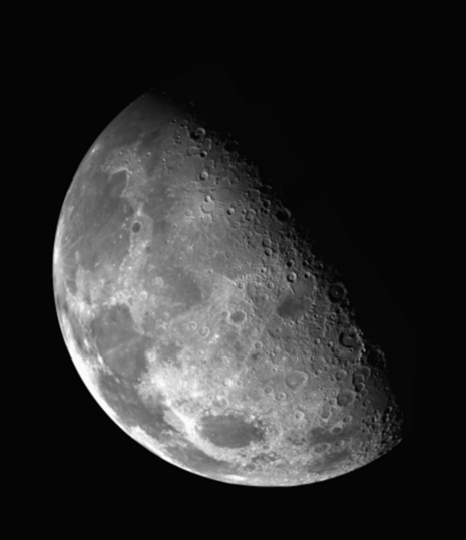
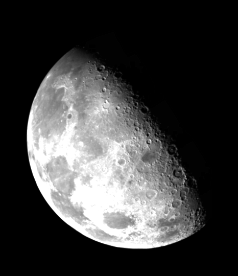
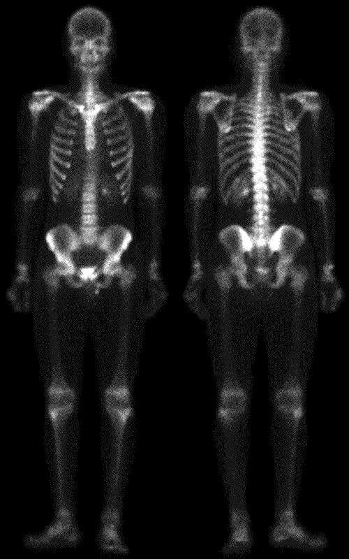
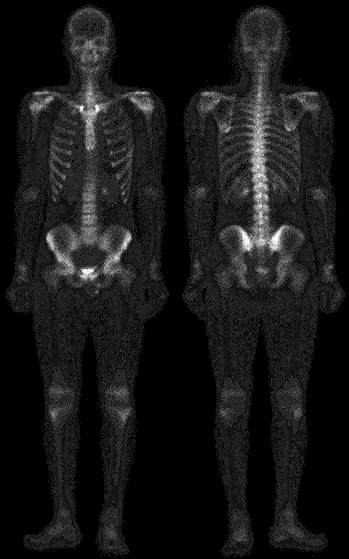
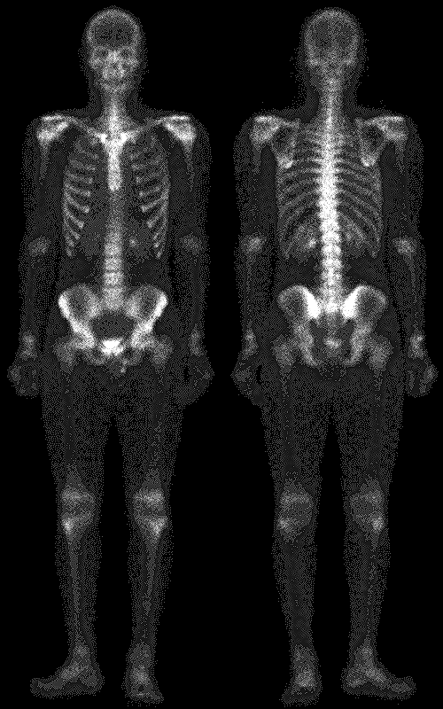
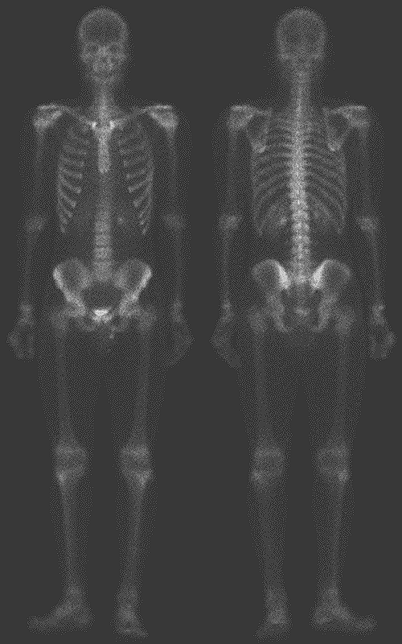
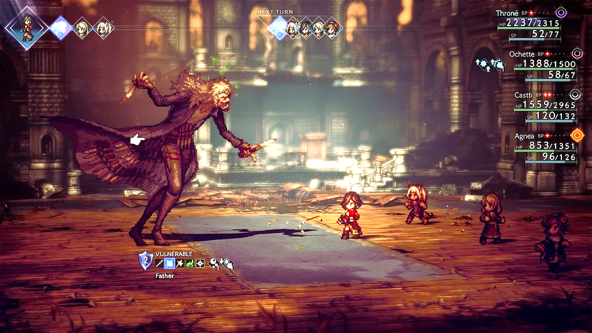
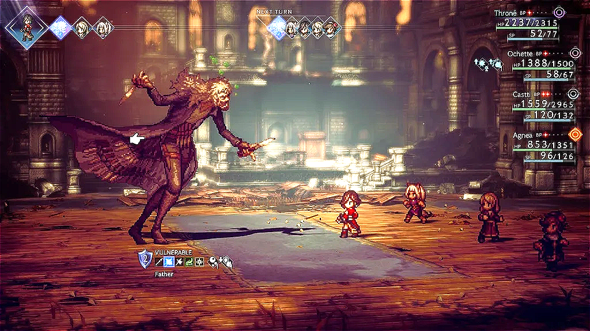
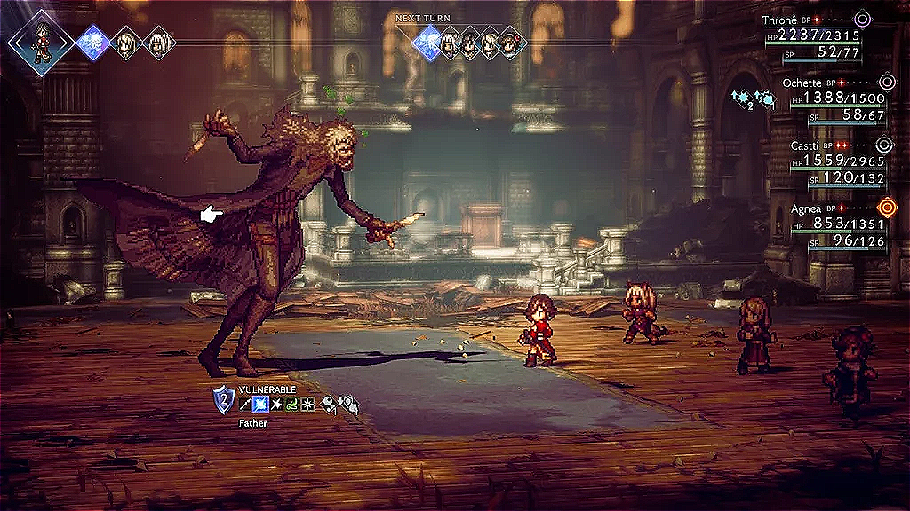
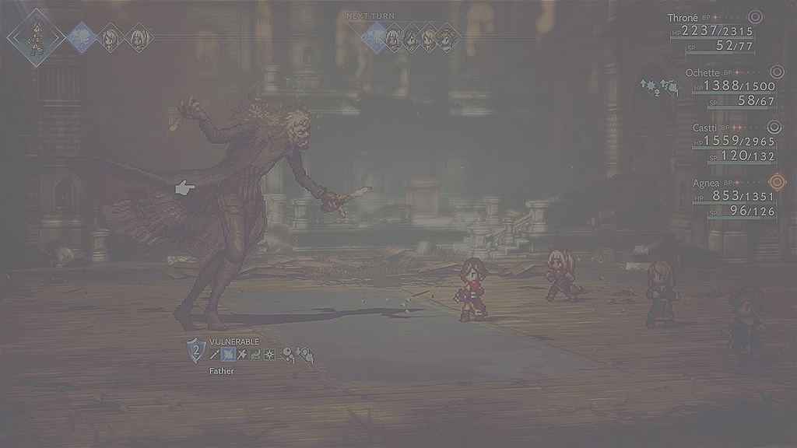

# HW2: Image Sharpening
徐子捷 411410030  
Due date: 2025/05/03   
Handed in date: 2025/05/12 (encounted lots of bugs, sorry for being *this* late...)

## Technical Description
The program does Image Sharpening and High-Boost Filtering [1] by:
1. **Sharpening** with negative **Laplacian operator** result (extracted details) + Origin image, by filter
    ```
    0 -1 0      0 0 0      0 -1 0
    -1 4 -1  +  0 1 0  =   -1 5 -1
    0 -1 0      0 0 0      0 -1 0
    ```
    then:
   1. *clamp* result range in [0, 255] (`laplacian_clamp_*.png`)
   2. *transform* result range back to [0, 255] by channel-wise scaling and shifting (`laplacian_scale_*.png`)
        - transformation is done channel-wise to keep the relationship between channels.  
2. \+ 0.5f * Origin image to **Hight Boost** result of 1.-1. (`laplacian_clamp_boost_*.png`)
    - clamp result to 255 if it > 255 
    - Doesn't try transformation because boosting is meant to just brighten the image.
3. **Sharpening** with extracted details from *deblurring* (Origin image - blur image) + Origin image, by filter
    ```
    0 0 0     0    0.2f 0        0 0 0     0     -0.2f 0
    0 1 0  -  0.2f 0.2f 0.2f  +  0 1 0  =  -0.2f 1.8f  -0.2f
    0 0 0     0    0.2f 0        0 0 0     0     -0.2f 0
    ``` 
    then, same as 1.:
      1. *clamp* result range in [0, 255] (`deblurr_clamp_*.png`)
      2. *transform* result range back to [0, 255] by channel-wise scaling and shifting (`deblurr_scale_*.png`)
           - transformation is done channel-wise to keep the relationship between channels.  
4. \+ 0.5f * Origin image to **Hight Boost** result of 3.-1. (`deblurr_clamp_boost_*.png`)
    - clamp result to 255 if it > 255
    - Doesn't try transformation because boosting is meant to just brighten the image.

Sharpening by *filter* is done by native **convoltion** each channel of the image with the filter in spatial space, then combine them back.
- when the image can't cover the filter, **zero padding** is used. 

### Build Guide
The program use [CMake](https://cmake.org/download/) as its build tool. 
1. `cd build`
2. `cmake ../. -G "MinGW Makefiles"`, or `cmake ../. -G "Visual Studio 17 2022"`, etc 
3. `cmake --build .`, or the usual way environment do, e.g., `mingw32-make`, IDE run button, etc
4. Executable built

Clean all files from CMake: (`/s`: Deletes specified dir and all its subdir)
1. `rmdir  /s .\`
2. alt + tab out your IDE to prevent cannot delete `because it is being used by another process.`

Clean built file only:
-  `cmake --build . --target clean`
### Execute Guide
0. put all `.bmp` and `.tif` inputs in `./test_images` relative to the executable.
1. open `cmd.exe`
2. enter `ImgSharpen.exe` and run
3. Results of Image Sharpening are in `./outputs` relative to the executable.

## Experimental Results
Meaning of results image position:
```
0 1
2 3
4 5
6
```
0. Deblurred Sharpening, transformed `deblurr_scale_*.png`
1. Origin Image
2. Deblurred Sharpening, clamped `deblurr_clamp_*.png`
3. Boosted clamped Sharpen Deblurred `deblurr_clamp_boost_*.png`
4. Laplacian Sharpening, clamped `laplacian_clamp_*.png`
5. Boosted clamped Sharpen Laplacian `laplacian_clamp_boost_*.png`
6. Laplacian Sharpening, transformed `laplacian_scale_*.png`

**blurry_moon.bmp** (466×540):   






**skeleton_orig.bmp** (500×800):   







<div style="page-break-after: always;"></div>

### Extra: Color Image
Origin Image (1024×576)

Deblurred Sharpening, transformed `deblurr_scale_*.png`

<div style="page-break-after: always;"></div>

Deblurred Sharpening, clamped `deblurr_clamp_*.png`

Boosted clamped Sharpen Deblurred `deblurr_clamp_boost_*.png`

<div style="page-break-after: always;"></div>

Boosted clamped Sharpen Laplacian `laplacian_clamp_boost_*.png`

Laplacian Sharpening, clamped `laplacian_clamp_*.png`

<div style="page-break-after: always;"></div>

Laplacian Sharpening, transformed `laplacian_scale_*.png`


## Discussions

**Observations:**  
1. **Laplacian images are more sharp than Deblurred images.**  
    When pixel value is near 255, the Laplacian filter:
    ```
    0  -1 0
    -1 5  -1
    0  -1 0
    ```
    can produce range [-1020, 1275], but the Deblurred filter
    ```
    0      -0.2f    0
    -0.2f  1.f-0.2f -0.2f
    0      -0.2f    0
    ```
    can only produce range [-204, 204].

    The bigger the range, the more responsive result to edges, i.e., the stronger the sharpening is when added to origin image.   
    But stronger sharpening isn't always better. For example, Laplacian Sharpening of **skeleton_orig.bmp** sharpens tissue details, which greatly affects visibility of thigh bones. 
2. **Transformed images are usually too gray.**  
    If the result range is large (e.g. [-1020, 1275]), the scaling may be terribly severe (e.g. 255/2295 = 0.1111). Since most pixels don't have this much differentiation, severe scaling greatly reduce contrast of other parts (thus it *unsharpens*), leaving the result "too gray".

    The only advantage is it represents differentiation after sharpening faithfully. A person can identify the *most* changes part in the image by finding the clearest part of the result (e.g. HP, MP number in **Color Image**)     

    Since the faithfulness, if the result range is small (like using the Deblurred filter), using Transform can be just *very slightly* better than Clamping, for example, **blurry_moon.bmp**. 

3. **Boosted images look more sharp.**  
    If origin pixel difference is $a-b$, after the boost is $1.5a-1.5b=1.5(a-b)$. The difference is enlarged by $1.5$ times, thus images looks more sharp. But if origin pixel value is near 255 or boosting too much (e.g. $+1.5$ of origin image), the Clamping will cut all value to 255. Not only complete an ultimate unsharpening, but also make the image tragically white. 

    Even if we find a perfect boost times, it's disadvantage is clear: it breaks origin brightness distribution, making the result "not like" the origin.

4. **Color images behave exactly the same as others.**   
   Edge and Details seldomly live in cross channel relationships, so the divide-and-conquer works. 

**Conclusions:**  
(usually) **the Best Sharpening** $\Rightarrow$ *Boosted, Clamped, Laplacian Sharpening*   
*Laplacian Sharpening* sharpen too much $\Rightarrow$ *Boosted, Deblurred Sharpening*   
Don't want *Boosting* to change color $\Rightarrow$ Remove it.  
Does *Transformed* works? $\Rightarrow$ Yes, but only for most drastical changing part and will dulling all the others parts as exchange.    
Color Image? works like a breeze.

## Reference & Appendix  
[1] R. C. Gonzalez and R. E. Woods, *Digital Image Processing*, 4th Ed., Pearson, New York, NY, 2018, Chapter 3.
